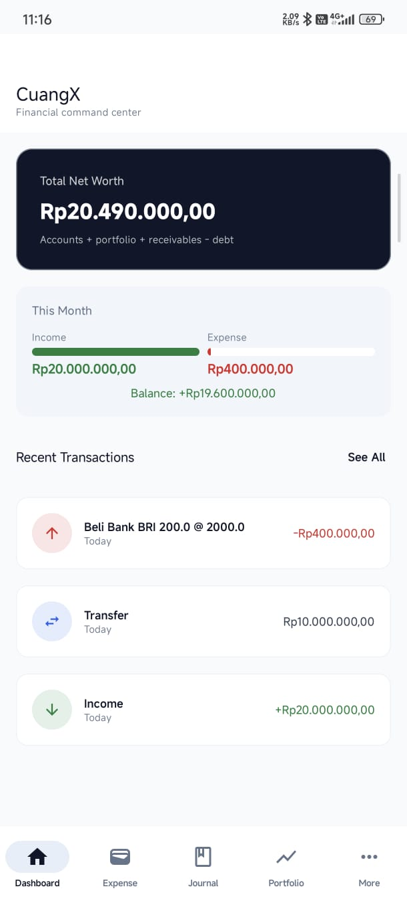
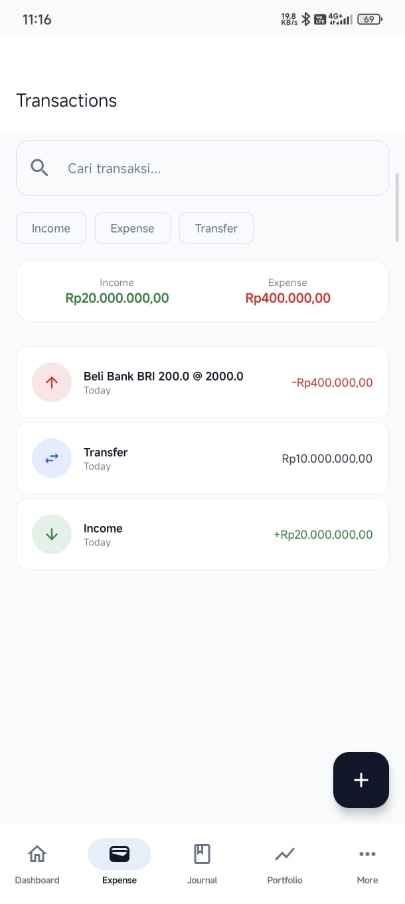
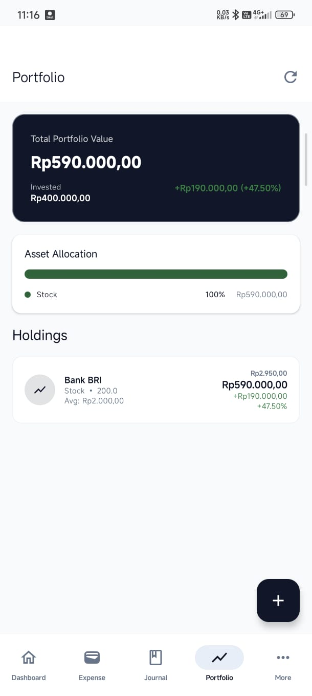
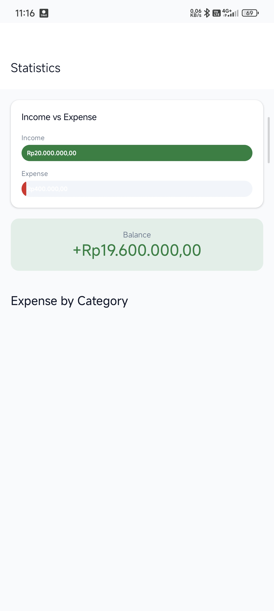
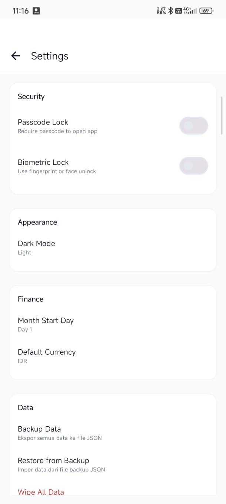

# CuangX Finance

<div align="center">

**Expense Manager + Portfolio Tracker**

[](https://www.android.com/)
[](https://kotlinlang.org/)
[](https://developer.android.com/jetpack/compose)
[](https://android-arsenal.com/api?level=26)
[](LICENSE)

*A comprehensive personal finance app that combines expense management with investment portfolio tracking.*

</div>

---

## Screenshots

<div align="center">

| Dashboard | Expense | Portfolio |
|:---------:|:-------:|:---------:|
|  |  |  |

| Statistics | Settings | Dark Mode |
|:----------:|:--------:|:---------:|
|  |  |  |

</div>

> **Note:** Letakkan screenshot di folder `docs/screenshots/` dengan nama file di atas.

---

## Features

### Expense Manager
- **Double-entry bookkeeping** — Catatan keuangan lengkap
- **Kategori & Sub-kategori** — Kelompokkan transaksi dengan icon dan warna
- **Budget per kategori** — Kontrol pengeluaran (mingguan/bulanan/tahunan)
- **Recurring transactions** — Transaksi otomatis berulang
- **Statistik & Grafik** — Analisis keuangan visual (pie, bar, line chart)
- **Calculator** — Kalkulator inline untuk input transaksi
- **Backup/Restore** — Export ke Excel (.xlsx)

### Portfolio Tracker
- **Multi-asset support** — Stocks, ETF, Crypto, Gold (Logam Mulia), Real Estate
- **Trading Journal** — Catatan keputusan investasi (source of truth)
- **Real-time prices** — Harga dari Yahoo Finance & Swissquote API
- **P&L tracking** — Unrealized & realized profit
- **Dividend tracker** — Pantau dividen masuk
- **Holding Detail** — Detail posisi dengan riwayat transaksi

### Utang & Piutang
- **Debt tracking** — Catat utang yang harus dibayar
- **Receivable tracking** — Catat piutang yang akan diterima
- **Payment history** — Riwayat pembayaran cicilan
- **Auto account sync** — Terintegrasi dengan Account

### Dashboard Terintegrasi
- **Net Worth** — Total kekayaan bersih
- **Cashflow bulanan** — Income vs Expense
- **Portfolio value** — Nilai investasi saat ini
- **Upcoming dues** — Jatuh tempo dekat

### Pengaturan
- **Multiple account types** — Cash, Bank, E-Wallet, Broker, Credit Card
- **Account Detail** — Detail akun dengan riwayat transaksi
- **Passcode/Biometric lock** — Keamanan aplikasi
- **Dark/Light mode** — Tema sesuai preferensi

---

## Tech Stack

| Component | Technology |
|-----------|------------|
| Language | Kotlin 2.1.0 |
| UI | Jetpack Compose + Material 3 |
| Architecture | MVVM + Clean Architecture |
| DI | Hilt 2.53.1 |
| Database | Room 2.6.1 (local only) |
| Networking | Retrofit 2.11.0 + Moshi |
| Charts | Vico 2.0.0-beta.2 |
| Background | WorkManager 2.10.0 |
| Image Loading | Coil 2.7.0 |
| Excel Export | Apache POI 5.2.5 |
| Biometric | AndroidX Biometric 1.1.0 |

---

## Data Sources

| Data | API | Endpoint |
|------|-----|----------|
| Stocks/ETF/Crypto | Yahoo Finance | `query1.finance.yahoo.com/v8/finance/chart/{TICKER}` |
| Gold Price | Yahoo Finance | `GC=F` (Gold Futures) |
| XAU/USD | Swissquote | `forex-data-feed.swissquote.com/public-quotes/bboquotes/instrument/XAU/USD` |
| USD/IDR Rate | Yahoo Finance | `USDIDR=X` |

---

## Getting Started

### Prerequisites
- Android Studio (latest stable)
- Android SDK 26+
- Java 17+

### Installation

1. **Clone repository**
   ```bash
   git clone https://github.com/YOUR_USERNAME/cuangx-finance.git
   cd cuangx-finance
   ```

2. **Open in Android Studio**
   - Open Android Studio
   - Select "Open an existing project"
   - Navigate to the cloned directory

3. **Build & Run**
   - Sync Gradle
   - Run on device/emulator

### Build APK

```bash
# Debug APK
.\gradlew.bat assembleDebug

# Release APK (requires keystore)
.\gradlew.bat assembleRelease
```

Output: `app/build/outputs/apk/`

---

## Project Structure

```
app/src/main/java/com/cuangx/finance/
├── core/
│   ├── database/        # Room entities, DAOs, migrations
│   ├── network/         # Retrofit APIs, models
│   ├── ui/              # Theme, navigation, components
│   ├── datastore/       # Preferences
│   └── util/            # Utilities (CurrencyFormatter, BackupManager)
├── domain/
│   ├── model/           # Domain models
│   └── repository/      # Repository interfaces
├── data/
│   ├── di/              # Hilt modules
│   └── repository/      # Repository implementations
├── feature/
│   ├── dashboard/       # Dashboard screen
│   ├── expense/
│   │   ├── account/     # Account CRUD + Detail
│   │   ├── transaction/ # Transaction CRUD
│   │   ├── category/    # Category management
│   │   ├── budget/      # Budget tracking
│   │   ├── recurring/   # Recurring transactions
│   │   └── statistics/  # Charts & analytics
│   ├── portfolio/
│   │   ├── journal/     # Trading journal
│   │   ├── holding/     # Holding detail + CRUD
│   │   ├── dividend/    # Dividend tracker
│   │   ├── analysis/    # Portfolio analysis
│   │   └── networth/    # Net worth tracking
│   ├── debt/            # Utang & Piutang
│   └── settings/        # App settings
└── worker/              # Background workers
```

---

## App Flow

```
┌─────────────┐     ┌─────────────┐     ┌─────────────┐
│   JOURNAL   │────►│ TRANSACTION │────►│   ACCOUNT   │
│  (Input)    │     │   (Auto)    │     │  (Balance)  │
└─────────────┘     └─────────────┘     └─────────────┘
       │                                       │
       ▼                                       ▼
┌─────────────┐                         ┌─────────────┐
│  PORTFOLIO  │                         │  DASHBOARD  │
│ (Positions) │                         │ (Net Worth) │
└─────────────┘                         └─────────────┘
```

---

## License

This project is licensed under the MIT License - see the [LICENSE](LICENSE) file for details.

---

## Contributing

Contributions are welcome! Please read the [Contributing Guidelines](CONTRIBUTING.md) first.

---

## Contact

**CuangX-by-fachriceg**
- GitHub: [@0xforcode-web](https://github.com/0xforcode-web)
- X: [@fachriceg](https://x.com/fachriceg)
---

## Acknowledgments

- [Yahoo Finance API](https://finance.yahoo.com/) for market data
- [Swissquote](https://www.swissquote.com/) for gold price feed
- [Material Design 3](https://m3.material.io/) for UI components
- [Jetpack Compose](https://developer.android.com/jetpack/compose) for modern UI toolkit
